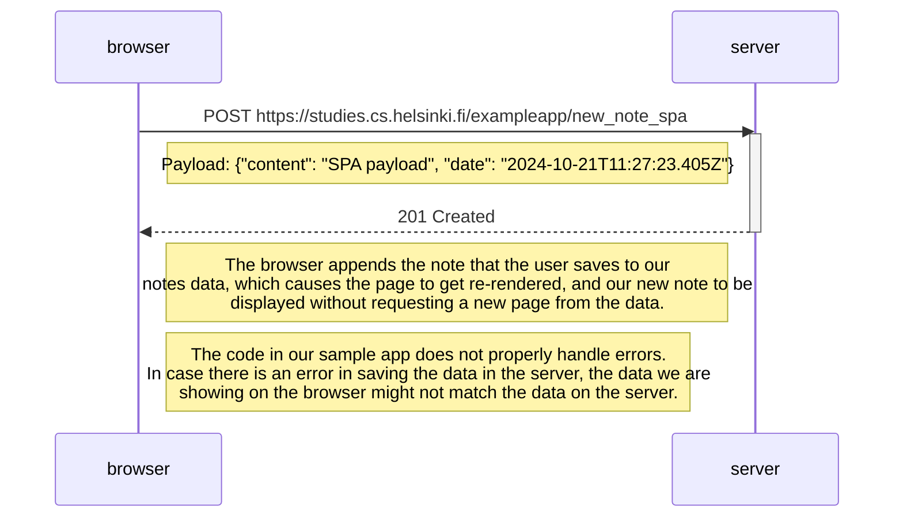

```mermaid
sequenceDiagram
    participant browser
    participant server

    browser->>server: POST https://studies.cs.helsinki.fi/exampleapp/new_note_spa
    activate server
    Note left of server: Payload: {"content": "SPA payload", "date": "2024-10-21T11:27:23.405Z"}
    server-->>browser: 201 Created
    deactivate server

    Note right of browser: The browser appends the note that the user saves to our <br>notes data, which causes the page to get re-rendered, and our new note to be <br>displayed without requesting a new page from the data.

    Note right of browser: The code in our sample app does not properly handle errors. <br>In case there is an error in saving the data in the server, the data we are <br>showing on the browser might not match the data on the server.
```